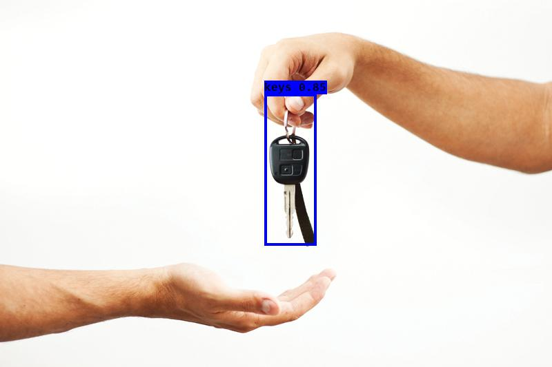

# keras-yolo3

## Introduction

A Keras implementation of YOLOv3 (Tensorflow backend) inspired by [qqwweee/keras-yolo3](https://github.com/qqwweee/keras-yolo3)
, [belarbi2733/keras_yolov3](https://github.com/belarbi2733/keras_yolov3) et [AlexeyAB/darknet](https://github.com/AlexeyAB/darknet?files=1&fbclid=IwAR0SXGIApiAwQi56RpME1urZQyO0EAGGWHfPLCmyhA-Uoa3xlAjGIbIPBF0).
This Work was applied on Keys datasets

<p align="center">
  
</p>


---

## Quick Start
1. Download datasets Keys without background and background images
2. Generate the new datasets (keys combined with background)
3. Download YOLOv3 weights from [YOLO website](http://pjreddie.com/darknet/yolo/).
4. Convert the Darknet YOLO model to a Keras model.
5. Run train1 and train2
6. Run YOLO detection.

```
## How it works
  #0. Importation des fichiers sur le git
  git clone https://github.com/ACOOLS/keras_yolov3
	#1. Téléchargement des clés et backgrounds:
	wget https://github.com/belarbi2733/keras_yolov3/releases/download/1/key_wb.zip
	wget https://github.com/belarbi2733/keras_yolov3/releases/download/1/bckgrnd.zip
  #2. Décompression :
	unzip key_wb.zip
	unzip bckgrnd.zip
	#3. Génération des fichiers  : annontation et keys_and_background:
	python keys_with_background.py --keys "key_wb" --background "bckgrnd" --output "keys_and_background"
  #4. Téléchargement de la base gender_man_woman
  wget https://github.com/ACOOLS/mon_code/releases/download/face/gender_dataset_face.zip 
  #5. Génération du fichier annonation.csv qui sera complété sur base de l'ancien fichier annotations.csv
  python face_annotations.py
  comme les images sont des visages des hommes et des femmes, donc nous avons pris x1=0,x2=x1+width,y1=0,y2=y1+height, veut dire nous avons pris toute l'image. 
  #6. Adaptation du fichier yolov3.cfg dans le dossier datasets
  Les changements sont le nombre des classes et les filtres 
  filters= (classes+5)*3
  Les lignes à modifier sont :
    pour classes -> ligne 610,696,783  classes=3
    pour filters -> ligne 603,689,776  filters=24
  #7. Télécharger les poids de YOLOv3 :
  wget https://pjreddie.com/media/files/yolov3.weights
  #8. Convert the Darknet YOLO model to a Keras model
  python convert.py yolov3.cfg yolov3.weights model_data/yolo_weights.h5
  #9. Lancer train1 and train2 :
  python train1.py --initial_epoch1 0 --epoch1 75 --batch_size1 16  --annotation 'annotations.csv' --classes     'model_data/key_classes.txt' --anchors 'model_data/yolo_anchors.txt' 
  python train2.py --initial_epoch2 75 --epoch2 150 --batch_size2 8 --annotation 'annotations.csv' --classes 'model_data/key_classes.txt' --anchors 'model_data/yolo_anchors.txt' 
  #10. Lancer la détection YOLO sur la base d'images de test:
  python test_yolo.py --image --input='test' --model 'ep138-loss5.570-val_loss5.466.h5' --classes 'model_data/key_classes.txt' --anchors 'model_data/yolo_anchors.txt'
  #11. Lancer la détection des clés sur la vidéo
python test_yolo.py --video --input "video-157367863.mp4" --output "video.mp4"  --model 'ep138-loss5.570-val_loss5.466.h5' --classes 'model_data/key_classes.txt' --anchors 'model_data/yolo_anchors.txt' 
```

### Usage
Use --help to see usage of yolo_video.py:
```
usage: test_yolo.py  [-h] [--model MODEL] [--anchors ANCHORS]
                     [--classes CLASSES] [--gpu_num GPU_NUM] [--image]
                     [--input] [--output]

positional arguments:
  --input        Video or Image input path
  --output       Video or Image output path

optional arguments:
  -h, --help         show this help message and exit
  --model MODEL      path to model weight file, default model_data/yolo.h5
  --anchors ANCHORS  path to anchor definitions, default
                     model_data/yolo_anchors.txt
  --classes CLASSES  path to class definitions, default
                     model_data/coco_classes.txt
  --image            Image detection mode, will ignore all positional arguments
```
---


---

## Some issues to know

1. The test environment is
    - Python 3.5
    - Keras 2.2.0
    - tensorflow 1.9.0

2. Default anchors are used. If you use your own anchors, probably some changes are needed.

3. The inference result is not totally the same as Darknet but the difference is small.

4. The speed is slower than Darknet. Replacing PIL with opencv may help a little.

5. Always load pretrained weights and freeze layers in the first stage of training. Or try Darknet training. It's OK if there is a mismatch warning.

6. The training strategy is for reference only. Adjust it according to your dataset and your goal. And add further strategy if needed.

7. For speeding up the training process with frozen layers train_bottleneck.py can be used. It will compute the bottleneck features of the frozen model first and then only trains the last layers. This makes training on CPU possible in a reasonable time. See [this](https://blog.keras.io/building-powerful-image-classification-models-using-very-little-data.html) for more information on bottleneck features.
